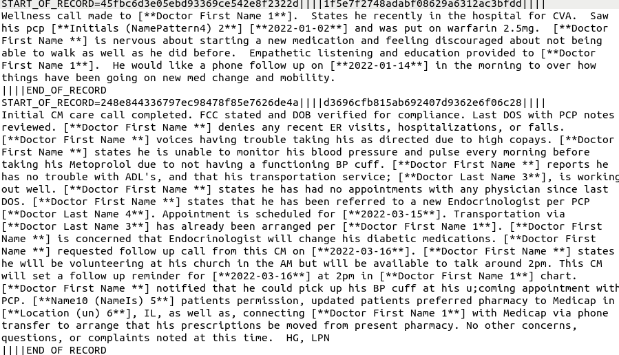

# CS 410 - Final Project: Topic Mining Healthcare Data & Classification

## Team Members

- Raman Walwyn-Venugopal - [rsw2@illinois.edu](rsw2@illinois.edu)
- Srikanth Bharadwaz Samudrala - [sbs7@illinois.edu](sbs7@illinois.edu)
- Satish Reddy Asi - [sasi2@illinois.edu](sasi2@illinois.edu)

## Quick Links
- [Proposal PDF](proposal.pdf)
- [Progress Report PDF](progress_report.pdf)

## Overview

The goal of this project is to perform topic mining and classification on
telehealth encounter nursing notes for notes that documented a positive outcome
for the patient form the telehealth services. To accomplish this, we divided
the project into three steps; curating the dataset, building a topic miner and
building a classifier. The topic miner will discover the topics/themes in
positive outcomes versus non-positive outcomes. The classifier will be able to
classify a nursing note as a positive outcome for the patient versus a
non-positive outcome.

### Curating Dataset

__Requirements:__
- [ruby 2.X](https://www.ruby-lang.org/en/libraries/)
- [perl 5.X](https://www.perl.org/)

_Note: This code was ran on ubuntu 18.04 and ubuntu 20.04_

#### Exporting Raw Dataset

The source of the data is from [TimeDocHealth](https://timedochealth.com/) that
has a care team that focuses on providing telehealth services to patients with
multiple chronic diseases.  Two CSV files, each containing 10,000 records were
exported from the TimeDoc system. One file named `positive_encounters.csv`
contained only notes that were labelled as a positive outcome due to the
telehealth services while another file named `no_positive_encounters.csv` only
contained notes that weren't labelled as a positive outcome for the patient.
The format of the exported CSV files are as follows:
`<note_id>,<patient_id>,<purpose>,<duration>,<note>` The `<purpose>` is an
array of attributes of the telehealth encounter, it is selected from a
pre-defined list and can provide insights to the actions of the telehealth
encounter. The  `<duration>` is the total amount of time the telehealth
encounter took, and `<note>` is the free-text nursing note summarizing the
encounter. The `<note>` data is what the topic mining and classification will
be performed on.


#### Automating De-Identification of Protected Health Information (PHI)

To ensure we're adhering to [HIPPA Privacy
Guidelines](https://www.physionet.org/content/deid/1.1/) we have to redact
Protected Health Information (PHI). This was redacted using the
[De-Identification (DEID) Software Package](
https://www.physionet.org/content/deid/1.1/). For the DEID to be effective,
it required creating separate files of patient names and identifiers
`pid_patientname.txt`, doctor first names `doctor_first_names.txt`, doctor last
names `doctor_last_names.txt`, locations `local_places.txt`, and company names
`company_names.txt`. The `pid_patientname.txt` was created by referencing all
the patients from the two exported CSV lists and curating a file formatted with
each line as `<PATIENT_ID>||||<PATIENT_FIRST_NAME>||||<PATIENT_LAST_NAME>`. The
`doctor_first_names.txt` and the `doctor_last_names.txt` files were created by
referencing exporting each care team member such as their Primary Care
Physician (PCP), Radiologist, etc. and writing each name to a new line. Both
files were scrubbed for duplicates and invalid data. The `local_places.txt` was
created by taking each address related for the patient and writing the city to
a town to each line. The `company_names.txt` file was created by listing out
the pharmacies and local healthcare organizations that the patient utilizes and
writing each to a new line.

For the DEID to perform the redaction of PHI, it required to be fed the notes
in a particular format. So the exported CSV file had to be transformed to the
following format:

```
START_OF_RECORD=<PATIENT_ID>||||<DOCUMENT_ID>||||
<DOCUMENT_CONTENT>
||||END_OF_RECORD
```

We accomplished this transformation for both of the CSV exported files using a
ruby script located at `deid/convert_csv_to_text.rb` and ran the
following commands:

```
# convert csv files to deid text format
ruby deid/convert_csv_to_text.rb demo_data/positive_encounters.csv
ruby deid/convert_csv_to_text.rb demo_data/no_positive_encounters.csv
```


The output produced two files named `positive_encounters.text` and
`no_positive_encounters.text` respectively. Afterwards we ran the DEID perl
script to remove the PHI using the following commands:

```
# enter deid directory
cd deid

# redact PHI from text files
perl deid.pl ../demo_data/positive_encounters deid-output.config
perl deid.pl ../demo_data/no_positive_encounters deid-output.config
```




The output produced two PHI redacted files named `positive_encounters.res` and
`no_positive_encounters.res`. To convert the files back into the CSV format, we
used the following script located at `deid/convert_res_to_csv.rb` and
ran the following commands:

```
# convert redacted res files to csv
ruby deid/convert_res_to_csv.rb \
  demo_data/positive_encounters.res \
  demo_data/positive_encounters.csv
ruby deid/convert_res_to_csv.rb \
  demo_data/no_positive_encounters.res \
  demo_data/no_positive_encounters.csv
```

The output produced two files named `positive_encounters.res.csv` and
`no_positive_encounters.res.csv`.


_Note: Since the DEID is an automated too, we have to account for the
possibility of not redacting all PHI data. To minimize actual PHI distributed
50 samples were taken form both the `positive_encounters.res` and
`no_positive_encounters.res` file and manually verified to not contain PHI.
This sampled may be provided upon request by emailing
[rsw2@illinois.edu](rsw2@illinois.edu)_

### Topic Mining

__Requirements:__
- [Python 3.X](https://www.python.org/)

__Python Libraries Used:__
- nltk
- pandas
- numpy
- matplotlib/pylab
- regex

__Extracting Documents__

The source to extract documents from is the notes. The Telemedicine responses are saved as CSV files with multiple fields. "notes" from the response file is fed as Document input to our PLSA implementation. The input responses file is in CSV file and the data is delimited by "," character.

__Generating stop words__

Stop words are generated using standard python nltk libraries. The stopwords are saved as file and is used as input for topic_miner program. stop words can be manually edited adding any tele-medicine specific words such as patient, call, treatment, phone etc.. since these are repeated frequently in every note. stop words program is run separately and the file is saved under "patient_data" folder where the input files are placed under.

__Mining Topics from Documents__

The topic_miner is run with data-file (in CSV format), stop-words file as input. The additional arguments to the program include number of topics, Max Iterations, Threshold, Number of Topic words. The arguments also include the path to output files: Document Topic Coverage, Topic Word Coverage, Vocabulary and Topic words.

More details about the module are available at: [topic miner](https://github.com/raman162/UofICS410FinalProject/blob/main/topic_miner/README.md)

_Note: Due to the slow performance of our manually written PLSA topic miner, we
created  [topic miner v2](topic_miner_v2/README.md) that uses an open source
python PLSA package and produces the same documents as our home-crafted PLSA
topic miner._

#### Setup


change to directory of topic miner
```
cd topic_miner_v2
```

Create new virtual environment
```
python -m venv venv
```

Activate virtual environment
```
source venv/bin/activate
```

Install required packages
```
pip install -r requirements.txt
```

#### Run Topic Miner

```
# python topic_miner.py <path/to/encounters.res.csv> <number_of_topics>

python topic_miner.py ../demo_data/all_encounters.res.csv 10
```

Output would be:

```
# topic coverage of topic probability per document in corpus
all_encounters.res.csv.10-doc-topic-cov.txt

#grouping of words and probabilities of topic per line
all_encounters.res.csv.10-topic-word-probs-grouped.txt

#all the probabilities for each topic per line
all_encounters.res.csv.10-topic-word-probs.txt

#all the words for each topic per line
all_encounters.res.csv.10-topics.txt

#vocabulary of corpus
all_encounters.res.csv.vocab
```


### Topic Analysis

__Requirements:__
- [Python 3.X](https://www.python.org/)

This topic analysis script performs analysis on the results of the topic miner
when both the positive and non-positive encounters are included in the whole
corpus. It attempts to:
1. Identify which topics are related to positive outcomes and which topics are
   related to non-positive outcomes
2. Pull the top words from the positive outcome topics and non-positive outcome
   topics
3. Highlight which top words from positive and non-positive overlap
   with each other versus which words are unique to their own topics
4. generates 3 files: `pos-non-pos-topics.txt`, `top-pos-words.txt` and
   `top-non-pos-words.txt`

#### Usage
```
python topic_analysis/topic_analysis.py \
  demo_data/all_encounters.res.csv.10-doc-topic-cov.txt \
  demo_data/all_encounters.res.csv.10-topics.txt
```

### Classifier

__Requirements:__
- [Python 3.X](https://www.python.org/)
- Python Virtual Environment Package (Included in Python standard library)

#### Overview of Functionality

The text classifier is responsible for reviewing the notes of the telehealth
encounters and classifying the note as positive outcome versus non-positive
outcome. The `classifier` module has the following features:
- Load positive and non-positive CSV files generated from the PHI
  De-identification process
- Clean data by removing PHI redaction sections, non-alphanumeric characters,
  extra white space, lemmatization, and stop words
- Generate a classifier using the
  [RandomForestClassifier](https://scikit-learn.org/stable/modules/generated/sklearn.ensemble.RandomForestClassifier.html)
  from sklearn
- Evaluate classifier by collecting Recall, Precision, F1 Score, micro averages
  per category, and the overall classification accuracy
- Store classifier to a file
- Load classifier from a file
- Score optimizer that steps through a combination of number of features and
  estimators for the classifier model and returns the optimal inputs and score

The process of generating the classifier requires the docs to be cleaned and
vectorized into TF-IDF weights. The vectorized version of the corpus was then
split into two sets; 20% for training and 80% for testing. The model used for
training is the `RandomForestClassifier` from `sklearn` which is based on a
Random Forest Algorithm that uses a 'random forest' of numerous decision trees.

The core of the algorithm follows the steps below:
- Pick N random records from the dataset
- Build a decision tree on the randomly selected N records
- Choose the number of trees used in the algorithm and repeat steps 1 and 2

The algorithm is ideal for classification because it is known to reduce
biases with the use of multiple randomly formed decision trees and it performs
well when unknown data points are introduced. Disadvantages of the algorithm is
that the complexity causes it to take longer to train and process due to the
amount of decision trees.

#### Setup

```
# change directory to classifier
cd classifier

# initlize python virtual evnrionment
python -m venv venv
source venv/bin/activate

# install dependencies
pip install -r requirements.txt
```

#### Usage

Be sure to update the following constants `POSITIVE_CSV_FILE` and
`NO_POSITIVE_CSV_FILE` to the true file paths of the redacted data produced
from the De-Identification process. Also update the `CLASSIFIER_FILE` for where
you want to store the classifier.


The `classifier` module can be run as a script to quickly generate a classifier
with the pre-optimized defaults determined from testing.

```
python classifier.py
```

This will load the data, clean the data, generate a classifier, print out the
evaluation metrics and store it to the path defined in the `CLASSIFIER_FILE`
constant. An example of the classifier evaluation is shown below.

```
              precision    recall  f1-score   support

non-positive       0.88      0.95      0.91      2014
    positive       0.94      0.85      0.90      1842

    accuracy                           0.91      3856
   macro avg       0.91      0.90      0.90      3856
weighted avg       0.91      0.91      0.90      3856

Accuracy:  0.9050829875518672
```

The classifier can be loaded and used on new documents. Enter the python
console and run the following commands
```
import classifier.py

text_classifier = classifier.load(classifier.CLASSIFIER_FILE)
docs = [
  'Scheduled transportation for patient appointment on Thursday',
  'discussed personal goals with patient for patient to work on quitting smoking'
  ]
predictions = classifier.predict(text_classifier, docs)
print(predictions)
```

#### Optimizations

The classification accuracy score was optimized by varying the number of
features and estimators (decision trees) used in the algorithm. This was a
simple iterative algorithm that calculated the accuracy for each
feature/estimator combination and then returned the optimal score and the
combination used to accomplish.

The classifier module has an `optimize_score` function that accepts the
following arguments:
```
docs (default: to cleaned version of dataset) - complete corpus of documents
labels (default to dataset defined) - labels each document
min_features (default: 1000)- start number of features to use
max_features (default: 5000)- max number of features to use
feature_step (default: 250) - amount to increase number of features by
min_df (default: 10) - minimum document frequency for a feature to be selected
max_df (default: 0.8) - maximum document frequency for a feature to be selected
min_estimators (default: 750) - start number of estimators to use
max_estimators (default: 2500) - max number of estimators to use
estimator_step (default: 250) - amount to increase number of estimators by
```

It outputs a dictionary that contains the following keys:
```
feature_steps - varying features used
estimator_steps - varying estimators used
scores - 2-dimension numpy array containing all scores generated. Shape is feature stpes length x estimator steps length
optimal_score - The highest accuracy result from the iterations
optimal_num_features - The number of features used to generate optimal score
optimal_num_estimators - The number of estimators used to generate optimal score
```

The optimal number of features used was determined to be 1500 while the optimal
number of estimators was determined to be 750.

#### BONUS: Classifying the top positive and top non-positive topic words

As a bonus test, we would test the classifier predictions on the top positive
and non-positive words generated from the [topic analysis](#topic-analysis)
step.

```
# enter python console
python

# import classifier module
import classifier

# load stored classifier
text_classifier = classifier.load(classifier.CLASSIFIER_FILE)
```

Classify top positive words
```
f = open('../demo_data/all_encounters.res.csv.2-topics.txt.top-pos-words.txt', 'r')
pos_docs = [f.read()]
f.close()
print('top pos words: ', pos_docs[0])
print('top pos words classifier predictions: ', classifier.predict(text_classifier, pos_docs)[0])
```

Classify top non-positive words
```
f = open('../demo_data/all_encounters.res.csv.2-topics.txt.top-non-pos-words.txt', 'r')
non_pos_docs = [f.read()]
f.close()
print('top non pos words: ', non_pos_docs[0])
print('top non pos words classifier predictions: ', classifier.predict(text_classifier, non_pos_docs)[0])
```

Output is
```
top pos words:  pharmacy appointment medication service information poa cuff call care sugar pressure concern blood morning meal state report insulin transportation time
top pos words classifier predictions:  positive

top non pos words:  pharmacy medication education exercise today appt goal inhaler level weight plan pressure knee minute state phone transportation day time ncm
top non pos words classifier predictions:  non-positive
```
